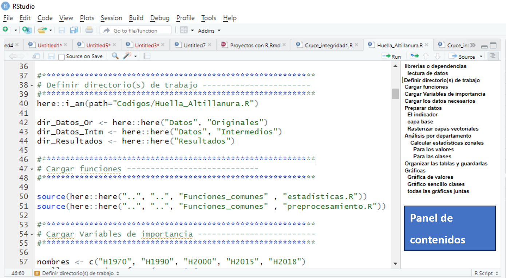

# Buenas prácticas de código
Los códigos no deben ser sólo funcionales, sino limpios, eficientes y fáciles de entender. Para esto aquí una lista de las mejores prácticas: 

1. Estilo de codificación consistente
2. Uso de comentarios
3. Uso de funciones
4. Uso de Bucles
5. Evitar objetos innecesarios
6. Haga pilotos
7. Busque la simplicidad y efectividad
8. Optimice luego

## 1. Estilo de Codificación Consistente:

- **Indentación**: La correcta indentación es fundamental para mejorar la legibilidad y organización del código. Permite mostrar claramente la estructura y jerarquía de las distintas partes, como bucles, condicionales y funciones.
- **Manejo de Espacios**: Es importante utilizar los espacios adecuadamente, como entre signos y números, y entre comas y números. Esto facilita la legibilidad y ayuda a evitar errores.
En RStudio puedes pulsar `Ctrl + Shift + A` para auto formatear el código y agregar espacios donde sea necesario. Paquetes como `styler` también tienen funciones para dar formato directamente a un archivo o incluso a directorios completos ((styler - A non-invasive source code formatter for R)[lorenzwalthert.github.io], (Non-Invasive Pretty Printing of R Code • styler)[r-lib.org]). Además, el paquete `lindr` y su función `lint()` proporcionan una lista de desviaciones de la guía de estilo,e incluye términos de lógica, como por ejemplo, variables no utilizadas.

- **Nomenclatura**: Adopte una convención de nomenclatura común para todo el código. Por ejemplo, usa prefijos para identificar tipos de objetos: rasters (`r_`), tablas (`t_`), capas vectoriales (`v_`). Piense en los objetos que estén relacionados y use prefijos consistentemente.
Utilice nombres cortos pero descriptivos con estilo "snake_case" (todas las letras en minúscula con un guion bajo para separar las palabras) para objetos y "camelCase" (cada palabra comienza con una mayúscula, excepto la primera en camelCase) para funciones.

#### Ejemplos:

```r
# Buena práctica
vector_123 <- c(1,2,3)

funcionExponencial <- function (exponent) {
  return (2 ** exponent)
}

# Mala Práctica
myvector <- c(1,2,3)

funcionexponencial_base2 <- function (exponent) {
  return (2 ** exponent)
}
```
## 2. Uso de comentarios:
Utilice los comentarios para guiar al lector, distinguir subsecciones o explicar por qué se hacen las cosas de una determinada manera.

En RStudio puede crear una sección con `Ctrl + Shift + R`, o agregando 4 guiones (`-` o `#`) después de un comentario.

```r
# algún comentario ----
# algún comentario ####
```
También puede crear subsecciones en R añadiendo `#` delante de una sección.
```r
## algún comentario ----
### algún comentario ----
```

En Rstudio esto permite la creación de un índice de secciones, facilitando la navegación dentro del código. 
En la gráfica inferior vea como las secciones definidas con numerales se traducen en un índice. El índice se puede abrir pulsando `Ctrl + Shift + O`.



## 3. Uso de funciones:
Es fundamental comprender la importancia de crear y utilizar funciones correctamente en el código. Repetir código copiando y pegando es una mala práctica. En lugar de escribir código repetitivo, cree funciones. Las funciones no solo hacen que su código sea más limpio y fácil de depurar, sino que también mejoran la legibilidad. 

Aunque los bucles (como `for`) son útiles, tienden a ser lentos. Siempre que sea posible, busque una forma de vectorizar el proceso o construya su bucle dentro de una función y ejecútelo con funciones de la familia `apply`.Las funciones vectorizadas (como `apply`, `lapply`, `sapply`, etc.) son más eficientes que los bucles convencionales.

***NOTA:*** *Al definir las funciones no permitir el uso de parametros globales. Defina todos los parameros que va a necesitar la función, para hacer la función más flexible y menos compleja para los usuarios.*

**Ejemplos:**
```r
# Mala práctica: Uso de parámetros globales
# Parámetro global
global_value <- 10

# Función que depende del parámetro global
suma_global <- function(x) {
  return(x + global_value)
}

# Uso de la función
suma_global(5)  # Esto depende de global_value, lo que puede generar confusión

# Buena práctica: Definir todos los parámetros dentro de la función
suma_flexible <- function(x, value) {
  return(x + value)
}

# Uso de la función con parámetros definidos
suma_flexible(5, 10)  # Aquí es más claro que 'value' es un parámetro que el usuario puede controlar
```
Cuando trabaje con funciones largas, si necesita ajustarlas para aplicarlas a otro análisis similar, es preferible dividir la función en partes más pequeñas o usar condicionales (por ejemplo, `if`, `while`). Esto facilitará su modificación y reutilización en otros contextos.

Finalmente, al llamar a funciones de R o propias, utilice argumentos con nombre y sepárelos claramente en su código para mejorar la legibilidad y facilitar la comprensión de los parámetros que está pasando a la función.

**Ejemplos:**
```r
# Buena práctica
datatable(data = Col_resumen1,
  options = list(
    pageLength = 33,
    paging = F,
    language = list(search = "Buscar:")
  )
)

# Mala práctica
datatable(Col_resumen1,
  options = list(33, F,  language = list(search = "Buscar:"))
)

```

## 4.Uso de Bucles:
Cuando use bucles, evite variables incrementales, en cambio preasigne las dimensiones de los vectores, listas y objetos de datos.

Considere los siguientes dos ejemplos de código. El primero asigna previamente el vector y accede al vector dentro del bucle `for` sin aumentar su tamaño mientras el segundo accede y hace crecer un vector dentro del bucle `for`.

### Ejemplos:
```r
# Buena práctica
x <- integer(n)
for (i in 1:n) {
    x[i] <- i^2
}

# Mala Práctica
x <- c() 
for (i in 1:n) {
    x <- c(x, i^2)
}
```

## 5. Evitar objetos innecesarios:
Evite la creación de objetos innecesarios y prevenga el uso de objetos redundantes. Por ejemplo, dos marcos de datos a y b donde b tiene una columna más que a. 

```r
z <- 5:9
a <- data.frame(x = 4, y = 1:5)
### Resultado de `a`
| x | y |
|---|---|
| 4 | 1 |
| 4 | 2 |
| 4 | 3 |
| 4 | 4 |
| 4 | 5 |

b <- cbind(a, z)
### Resultado de `b`
| x | y | z |
|---|---|---|
| 4 | 1 | 5 |
| 4 | 2 | 6 |
| 4 | 3 | 7 |
| 4 | 4 | 8 |
| 4 | 5 | 9 |

```
## 6. Haga pilotos de su proceso antes de usar los datos completos.
## 7. Busque la simplicidad y efectividad:
Cuanto más sencillo sea el código, menores serán las probabilidades de cometer errores , y estos serán más fáciles de rastrear. 

Sin embargo, en algunas ocasiones, un poco más de código puede ser más eficiente debido a la forma en que operan las funciones. Por eso, es fundamental estar bien informado sobre las funciones que utiliza y leer detenidamente la documentación básica. Esto es indispensable para ser más creativo y tener mayor libertad a la hora de programar. 

## 8. Optimice luego:
Primero enfóquese en encontrar la solución y luego en optimizarla. Invertir tiempo en la optimización antes de resolver el problema es inútil, ya que el código puede cambiar drásticamente durante la búsqueda de soluciones.
La optimización se centra en mejorar la velocidad y reducir el consumo de memoria. Para ello, herramientas como `Rprof()`, `system.time()`, y `gc()` son muy útiles. También puede considerar paquetes como `rbenchmark`, `microbenchmark`, y `pbdPROF` para realizar mediciones y optimizaciones más detalladas.

# Errores comunes
- Olvidar cerrar un paréntesis o una llave.
- Usar una variable antes de que haya sido definida.
- Confundir mayúsculas y minúsculas.
- Evita usar los mismos nombres para variables y funciones.

# Tips para ser felices:
- `Alt + -` para la asignación `<-`.
- `Ctrl + Shift + M` para `%>%`.
- Usa `TRUE` y `FALSE`, no `T` y `F`.
- Evita guardar espacios de trabajo completos, mejor guarda objetos con `save()` o `saveRDS()`.

 # Bibliografía y enlaces de soporte:

(Buenas prácticas en R -Yizinet)[https://www.yizinet.com/buenas-practicas-en-r/]
(Quince consejos para mejorar nuestro código y flujo de trabajo con R) [frodriguezsanchez.net]
(Mejores Prácticas de Programación en R para Estudiantes y Profesionales) [gyata.ai]
(Unidad 8 Buenas prácticas en R y Rstudio | bookdown-LimnoR) [limno-con-r.github.io]

