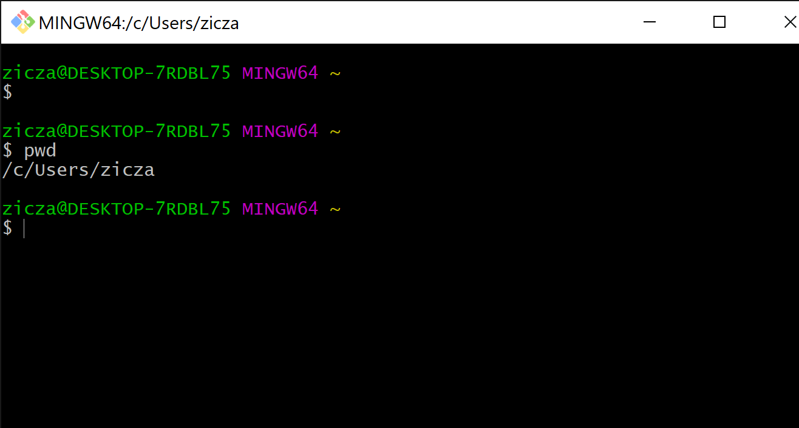
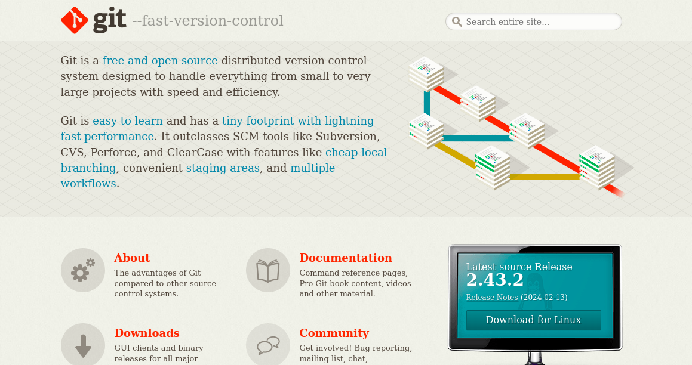
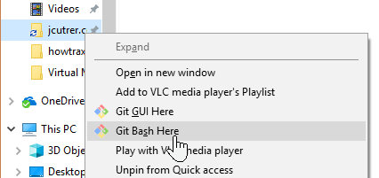
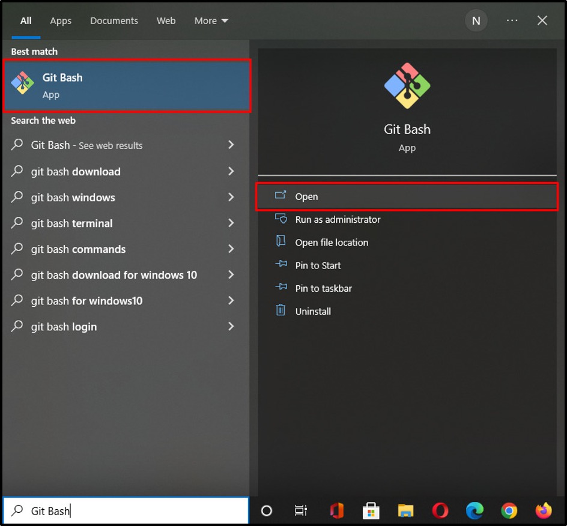

# Tips para el uso de GIT

Este repositorio almacena plantillas, pautas y otras herramientas para facilitar el trabajo colaborativo en proyectos que involucran código.

Progresivamente se van introduciendo nuevos materiales. Mientras tanto, diviértete:

https://imgs.xkcd.com/comics/git.png

## Antes de empezar
### Para usuarios de windows
En windows existe una forma sencilla de interactuar con los diferentes comandos de Git, el **Git Bash**. A continuación encontrará unos sencillos pasos para que la descargue y la pueda empezar a usar.

1. Descargue Git Bash desde el sitio web oficial: https://git-scm.com/

2. Ejecute el archivo .exe que acaba de descargar y siga las instrucciones del instalador.

3. Ejecuta Git Bash haciendo clic derecho en cualquier carpeta y seleccionando la opción Git Bash...

    

... o seleccionando git bash desde el menú de inicio de windows

### Usuarios Mac OS y Linux
En estos dos sistemas operativos la terminal será la herramienta apropiada para usar Git

## README templates

- [Configuración inicial](configuracion_inicial.md) -> inicia Git con tus credenciales: correo y usuario

- [Plantilla para llaves ssh](acerca_de_llaves_SSH(ssh_keys).md) -> esta clave es necesaria para una mejor seguridad al momento de envia codigo al remoto

- [Plantilla para scripts](readme_template_for_scripts.md) -> si vas a incluir un script

- [Plantilla para proyectos de software](readme_template.md) -> Al momento de iniciar un proyecto completo