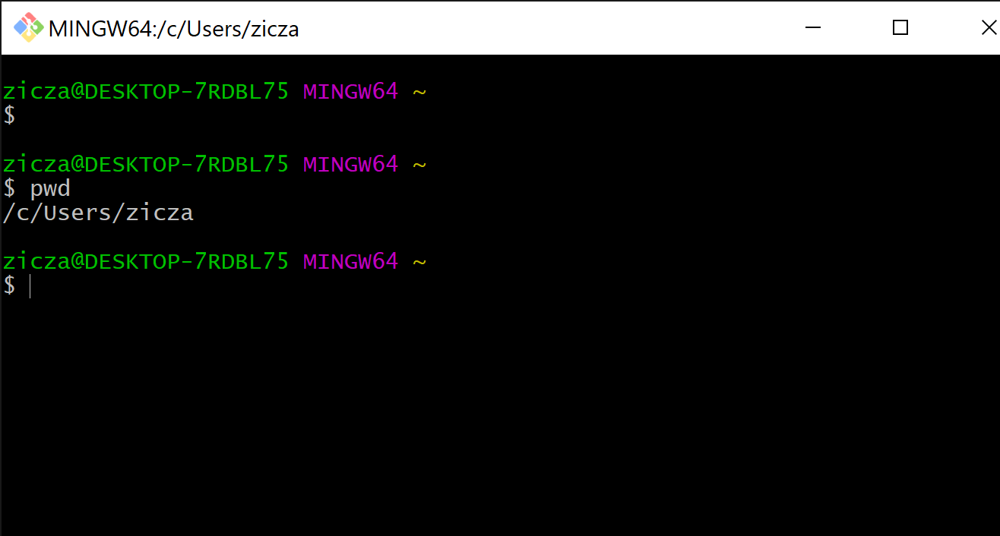
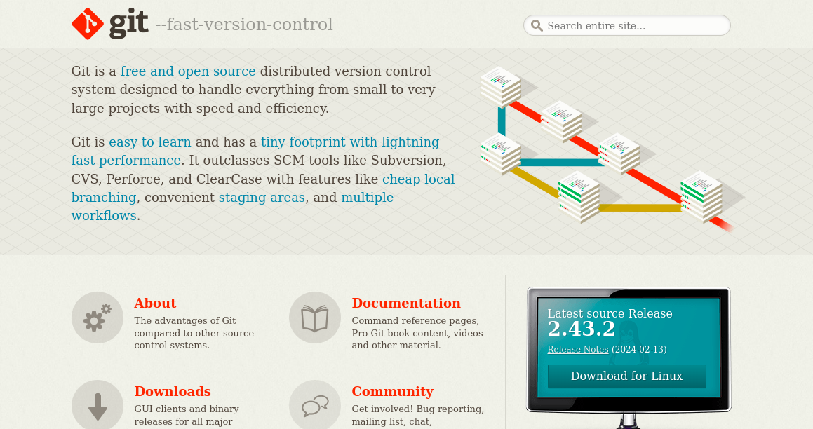
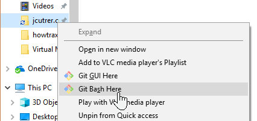
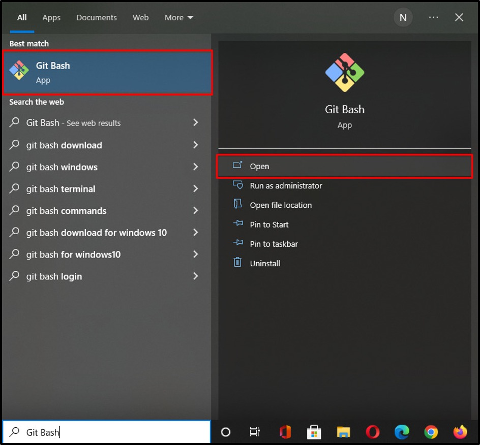

# Ayuda con GIT

## Instalar GIT
### Para usuarios de windows
En windows existe una forma sencilla de interactuar con los diferentes comandos de Git, el **Git Bash**. A continuación encontrará unos sencillos pasos para que la descargue y la pueda empezar a usar.

1. Descargue Git Bash desde el sitio web oficial: https://git-scm.com/

2. Ejecute el archivo .exe que acaba de descargar y siga las instrucciones del instalador.

3. Ejecuta Git Bash haciendo clic derecho en cualquier carpeta y seleccionando la opción Git Bash...

    

... o seleccionando git bash desde el menú de inicio de windows

### Usuarios Mac OS y Linux
En estos dos sistemas operativos la terminal será la herramienta apropiada para usar Git

## Configurar GIT

- [Configuración inicial](configuracion_inicial.md) -> inicia Git con tus credenciales: correo y usuario
- [Configurando llaves ssh](acerca_de_llaves_SSH(ssh_keys).md) -> esta clave es necesaria para una mejor seguridad al momento de envia codigo al remoto
- [Configurando alias](configuracion_aliases.md) -> Generar nombres mas cortos para acciones tipicas o comandos largos

## Recursos

### Libro para aprender GIT
Toda la documentación para el uso de Git se encuentra en este libro (el cual cuenta con ejemplos), así que si desea profundizar en algunos temas, este es un buen punto de partida.

[libro en español](https://git-scm.com/book/es/v2)
